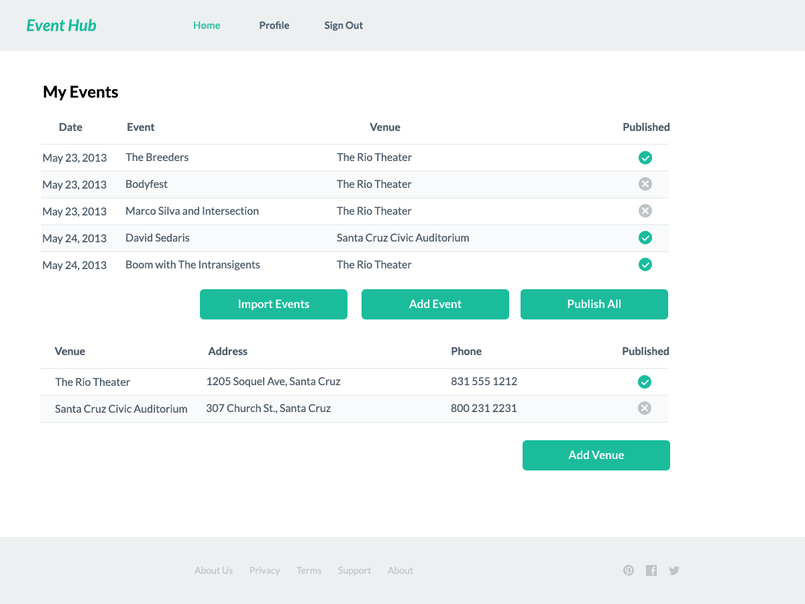

Producer Web Site
=================

This section shows the conceptual layout of producer web site.  Page layouts
and content may change based on the details of the site requirements.

Click on any screenshot to enlarge.

Login
-----

The login page provides form fields for the user to enter their login name and
password and a button for registration.  It also shows some example events.

Registration
------------

New users sign up for the Event Hub on this page.  Each user must be associated with
a producer, so if they don't select an existing producer they will be prompted to create
a new one.

User Profile
------------

On this page, the user can change their contact information, password, and avatar.

Event and Venue List
--------------------

This page lists events and venues that the user can edit or publish.

New/Edit Venue
--------------

Venue information can be entered or modified on this page.

New/Edit Event
--------------

This is the page where new events are created or existing events are modified.

